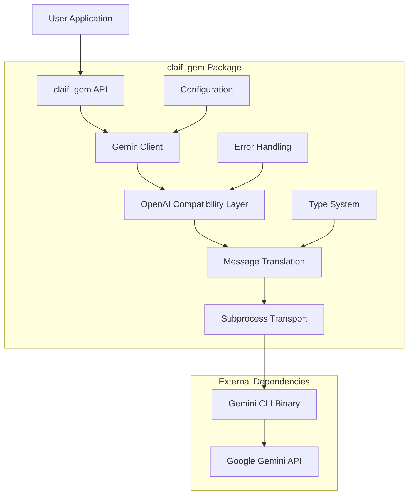
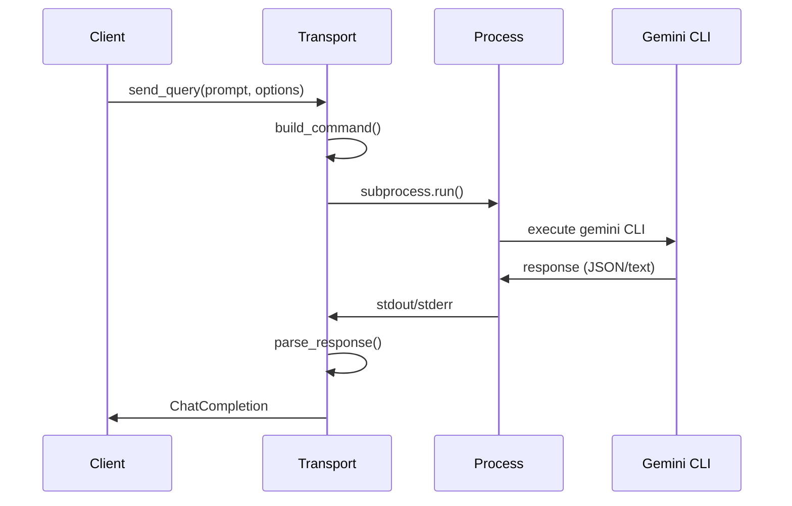

# Architecture Guide

Deep dive into the internal design and implementation of `claif_gem`. Understand how the package works under the hood, design decisions, and architectural patterns.

## 🏗️ High-Level Architecture

### System Overview



### Design Principles

1. **OpenAI Compatibility** - Drop-in replacement for OpenAI client
2. **Subprocess Isolation** - Reliable CLI communication through subprocess management
3. **Type Safety** - Comprehensive type hints and OpenAI type compatibility
4. **Error Resilience** - Robust error handling and recovery mechanisms
5. **Cross-Platform** - Works on Windows, macOS, and Linux
6. **Minimal Dependencies** - Lightweight with essential dependencies only

## 🏢 Package Structure

### Module Organization

```
src/claif_gem/
├── __init__.py          # Package initialization and exports
├── __version__.py       # Version information (auto-generated)
├── client.py           # Main GeminiClient implementation
├── cli.py              # Command-line interface (Fire-based)
├── config.py           # Configuration management
├── types.py            # Type definitions and data classes
├── exceptions.py       # Custom exception classes
├── transport.py        # Subprocess communication layer
└── utils.py            # Utility functions and helpers
```

### Responsibility Matrix

| Module | Primary Responsibility | Dependencies | Exports |
|--------|----------------------|--------------|---------|
| `__init__.py` | Package entry point | All modules | `GeminiClient`, `__version__` |
| `client.py` | OpenAI-compatible client | `transport`, `types` | `GeminiClient`, `Chat`, `ChatCompletions` |
| `cli.py` | Command-line interface | `client`, `config` | `CLI`, `main` |
| `config.py` | Configuration management | `types` | `GeminiConfig` |
| `types.py` | Type definitions | OpenAI types | Custom types and aliases |
| `exceptions.py` | Error handling | None | Exception classes |
| `transport.py` | Subprocess communication | `exceptions` | `GeminiTransport` |
| `utils.py` | Utility functions | None | Helper functions |

## 🔧 Core Components

### 1. GeminiClient (`client.py`)

The main entry point that provides OpenAI-compatible interface.

#### Class Hierarchy

```python
GeminiClient
├── Chat
│   └── ChatCompletions
│       ├── create() -> ChatCompletion | Iterator[ChatCompletionChunk]
│       ├── _create_sync() -> ChatCompletion
│       └── _create_stream() -> Iterator[ChatCompletionChunk]
└── _find_gemini_cli() -> str
```

#### Key Methods

```python
class GeminiClient:
    def __init__(self, api_key=None, cli_path=None, timeout=600.0):
        """Initialize client with configuration and CLI discovery."""
        
    def _find_gemini_cli(self, cli_path: str | None) -> str:
        """Discover Gemini CLI in multiple locations."""
        
class ChatCompletions:
    def create(self, **kwargs) -> ChatCompletion | Iterator[ChatCompletionChunk]:
        """Main completion creation method."""
        
    def _create_sync(self, cmd: list[str], model: str) -> ChatCompletion:
        """Synchronous completion execution."""
        
    def _create_stream(self, cmd: list[str], model: str) -> Iterator[ChatCompletionChunk]:
        """Streaming completion execution."""
        
    def _map_model_name(self, model: str) -> str:
        """Map OpenAI model names to Gemini equivalents."""
```

#### Design Patterns

**Namespace Pattern**: Mimics OpenAI's `client.chat.completions.create()` structure:

```python
# OpenAI pattern
client = OpenAI()
response = client.chat.completions.create(...)

# claif_gem pattern (identical)
client = GeminiClient()
response = client.chat.completions.create(...)
```

**Adapter Pattern**: Translates between OpenAI and Gemini interfaces:

```python
def _map_model_name(self, model: str) -> str:
    """Adapter for model name translation."""
    model_map = {
        "gpt-4": "gemini-1.5-pro",
        "gpt-3.5-turbo": "gemini-1.5-flash",
        # ... more mappings
    }
    return model_map.get(model, model)
```

### 2. Transport Layer (`transport.py`)

Handles subprocess communication with the Gemini CLI.

#### Architecture



#### Key Components

```python
class GeminiTransport:
    def build_command(self, prompt: str, options: GeminiOptions) -> list[str]:
        """Build CLI command with arguments."""
        
    def execute_sync(self, cmd: list[str]) -> subprocess.CompletedProcess:
        """Execute command synchronously."""
        
    def parse_output(self, output: str) -> str:
        """Parse CLI output (JSON or plain text)."""
        
    def handle_errors(self, process: subprocess.CompletedProcess) -> None:
        """Handle CLI execution errors."""
```

#### Error Handling Strategy

```python
def safe_execution(self, cmd: list[str]) -> str:
    try:
        result = subprocess.run(
            cmd, 
            capture_output=True, 
            text=True, 
            timeout=self.timeout,
            check=True
        )
        return self.parse_output(result.stdout)
        
    except subprocess.TimeoutExpired:
        raise GeminiTimeoutError(self.timeout, "CLI execution")
        
    except subprocess.CalledProcessError as e:
        raise GeminiCLIError(f"CLI error: {e.stderr}", e.returncode, e.stderr)
        
    except FileNotFoundError:
        raise GeminiCLIError("Gemini CLI not found", -1)
```

### 3. Configuration Management (`config.py`)

Centralized configuration handling with multiple sources.

#### Configuration Hierarchy

```
1. Runtime Parameters (highest priority)
2. Environment Variables
3. Configuration Files
4. Default Values (lowest priority)
```

#### Implementation

```python
@dataclass
class GeminiConfig:
    # Configuration fields with defaults
    api_key: str | None = None
    default_model: str = "gemini-1.5-flash"
    # ... more fields
    
    @classmethod
    def load(cls) -> 'GeminiConfig':
        """Load configuration from all sources."""
        # 1. Start with defaults
        config = cls()
        
        # 2. Override with config file
        config.update_from_file()
        
        # 3. Override with environment variables
        config.update_from_env()
        
        return config
    
    def update_from_env(self) -> None:
        """Update configuration from environment variables."""
        if api_key := os.getenv('GEMINI_API_KEY'):
            self.api_key = api_key
        # ... more env vars
    
    def update_from_file(self) -> None:
        """Update configuration from file."""
        for path in self.config_paths:
            if path.exists():
                self.update_from_dict(json.loads(path.read_text()))
                break
```

### 4. Type System (`types.py`)

Comprehensive type definitions ensuring compatibility and safety.

#### Type Categories

1. **OpenAI Compatibility Types** - Direct imports from `openai` package
2. **Internal Types** - Custom types for internal use
3. **Configuration Types** - Configuration-related types
4. **Utility Types** - Helper types and aliases

```python
# OpenAI compatibility
from openai.types.chat import (
    ChatCompletion,
    ChatCompletionChunk,
    ChatCompletionMessageParam,
    # ... more imports
)

# Custom types
@dataclass
class GeminiMessage:
    role: str
    content: str
    metadata: dict[str, Any] | None = None

@dataclass
class GeminiOptions:
    model: str | None = None
    temperature: float | None = None
    # ... more fields

# Type aliases
MessageList = list[ChatCompletionMessageParam]
ResponseStream = Iterator[ChatCompletionChunk]
```

## 🔄 Data Flow

### Request Processing Pipeline

```mermaid
flowchart TD
    A[User Request] --> B[GeminiClient.create()]
    B --> C[Parameter Validation]
    C --> D[Message Translation]
    D --> E[Command Building]
    E --> F[CLI Execution]
    F --> G[Response Parsing]
    G --> H[Type Conversion]
    H --> I[Return Response]
    
    J[Error Handler] --> C
    J --> F
    J --> G
    
    K[Configuration] --> B
    K --> E
```

### Message Translation

#### OpenAI to Gemini Format

```python
def translate_messages(messages: list[ChatCompletionMessageParam]) -> str:
    """Convert OpenAI messages to Gemini CLI format."""
    prompt_parts = []
    system_prompt = None
    
    for message in messages:
        if message["role"] == "system":
            system_prompt = message["content"]
        elif message["role"] == "user":
            prompt_parts.append(f"Human: {message['content']}")
        elif message["role"] == "assistant":
            prompt_parts.append(f"Assistant: {message['content']}")
    
    prompt = "\n\n".join(prompt_parts)
    
    if system_prompt:
        prompt = f"System: {system_prompt}\n\n{prompt}"
    
    return prompt
```

#### Gemini to OpenAI Format

```python
def create_chat_completion(content: str, model: str) -> ChatCompletion:
    """Create OpenAI-compatible response from Gemini output."""
    timestamp = int(time.time())
    response_id = f"chatcmpl-{timestamp}{os.getpid()}"
    
    # Estimate token counts
    prompt_tokens = len(prompt.split()) * 2
    completion_tokens = len(content.split()) * 2
    
    return ChatCompletion(
        id=response_id,
        object="chat.completion",
        created=timestamp,
        model=model,
        choices=[
            Choice(
                index=0,
                message=ChatCompletionMessage(
                    role="assistant",
                    content=content
                ),
                finish_reason="stop",
                logprobs=None,
            )
        ],
        usage=CompletionUsage(
            prompt_tokens=prompt_tokens,
            completion_tokens=completion_tokens,
            total_tokens=prompt_tokens + completion_tokens
        )
    )
```

### Streaming Implementation

#### Chunk Generation Strategy

```python
def _create_stream(self, cmd: list[str], model: str) -> Iterator[ChatCompletionChunk]:
    """Generate streaming chunks from synchronous response."""
    # Get full response first (temporary implementation)
    full_response = self._create_sync(cmd, model)
    
    timestamp = int(time.time())
    chunk_id = f"chatcmpl-{timestamp}{os.getpid()}"
    
    # Initial chunk with role
    yield ChatCompletionChunk(
        id=chunk_id,
        object="chat.completion.chunk",
        created=timestamp,
        model=model,
        choices=[
            ChunkChoice(
                index=0,
                delta=ChoiceDelta(role="assistant", content=""),
                finish_reason=None
            )
        ]
    )
    
    # Content chunks (split by words for demonstration)
    content = full_response.choices[0].message.content
    words = content.split()
    
    for i, word in enumerate(words):
        chunk_content = word + (" " if i < len(words) - 1 else "")
        
        yield ChatCompletionChunk(
            id=chunk_id,
            object="chat.completion.chunk",
            created=timestamp,
            model=model,
            choices=[
                ChunkChoice(
                    index=0,
                    delta=ChoiceDelta(content=chunk_content),
                    finish_reason=None
                )
            ]
        )
    
    # Final chunk
    yield ChatCompletionChunk(
        id=chunk_id,
        object="chat.completion.chunk",
        created=timestamp,
        model=model,
        choices=[
            ChunkChoice(
                index=0,
                delta=ChoiceDelta(),
                finish_reason="stop"
            )
        ]
    )
```

## 🔍 CLI Discovery Algorithm

### Multi-Location Search Strategy

```python
def _find_gemini_cli(self, cli_path: str | None = None) -> str:
    """Comprehensive CLI discovery algorithm."""
    
    # Priority 1: Explicit path parameter
    if cli_path and self._validate_cli_path(cli_path):
        return cli_path
    
    # Priority 2: Environment variable
    if env_path := os.getenv("GEMINI_CLI_PATH"):
        if self._validate_cli_path(env_path):
            return env_path
    
    # Priority 3: System PATH
    if path := shutil.which("gemini"):
        return path
    
    # Priority 4: Common installation locations
    search_locations = [
        "~/.local/bin/gemini",
        "/usr/local/bin/gemini",
        "/opt/homebrew/bin/gemini",  # macOS Homebrew ARM
        "~/node_modules/.bin/gemini",  # Local npm install
        "~/.npm-global/bin/gemini",   # Global npm with prefix
    ]
    
    # Platform-specific locations
    if os.name == "nt":  # Windows
        search_locations.extend([
            "C:/Program Files/nodejs/gemini.cmd",
            os.path.expanduser("~/AppData/Roaming/npm/gemini.cmd"),
        ])
    
    for location in search_locations:
        expanded_path = os.path.expanduser(location)
        if self._validate_cli_path(expanded_path):
            return expanded_path
    
    # Priority 5: npm global directory detection
    try:
        npm_global = subprocess.run(
            ["npm", "config", "get", "prefix"],
            capture_output=True,
            text=True,
            check=True
        ).stdout.strip()
        
        npm_gemini = os.path.join(npm_global, "bin", "gemini")
        if self._validate_cli_path(npm_gemini):
            return npm_gemini
            
    except (subprocess.CalledProcessError, FileNotFoundError):
        pass
    
    raise FileNotFoundError(
        "Gemini CLI not found. Please install it with: npm install -g @google/gemini-cli"
    )

def _validate_cli_path(self, path: str) -> bool:
    """Validate that a path points to a working Gemini CLI."""
    try:
        path_obj = Path(path)
        return path_obj.exists() and path_obj.is_file() and os.access(path, os.X_OK)
    except OSError:
        return False
```

## ⚠️ Error Handling Architecture

### Exception Hierarchy Design

```python
# Base exception with structured error information
class GeminiError(Exception):
    def __init__(self, message: str, details: dict | None = None, cause: Exception | None = None):
        super().__init__(message)
        self.message = message
        self.details = details or {}
        self.cause = cause
    
    def __str__(self) -> str:
        result = self.message
        if self.details:
            result += f" (Details: {self.details})"
        if self.cause:
            result += f" (Caused by: {self.cause})"
        return result

# Specific error types
class GeminiTimeoutError(GeminiError):
    def __init__(self, timeout: float, operation: str = "request"):
        super().__init__(
            f"{operation.capitalize()} timed out after {timeout} seconds",
            {"timeout": timeout, "operation": operation}
        )

class GeminiCLIError(GeminiError):
    def __init__(self, message: str, return_code: int, stderr: str = ""):
        super().__init__(
            message,
            {"return_code": return_code, "stderr": stderr}
        )
        self.return_code = return_code
        self.stderr = stderr
```

### Error Recovery Strategies

```python
class ErrorRecovery:
    @staticmethod
    def handle_cli_not_found(e: GeminiCLIError) -> str:
        """Provide helpful CLI installation guidance."""
        return """
        Gemini CLI not found. Try these solutions:
        
        1. Install via npm: npm install -g @google/gemini-cli
        2. Install via bun: bun add -g @google/gemini-cli  
        3. Set custom path: export GEMINI_CLI_PATH=/path/to/gemini
        4. Check PATH: echo $PATH
        """
    
    @staticmethod
    def handle_api_error(e: GeminiAPIError) -> str:
        """Provide API error guidance."""
        if e.status_code == 401:
            return "Invalid API key. Check GEMINI_API_KEY environment variable."
        elif e.status_code == 429:
            return "Rate limit exceeded. Wait before retrying or upgrade your plan."
        elif e.status_code == 500:
            return "Gemini API server error. Try again later."
        else:
            return f"API error (status {e.status_code}). Check API status and try again."
```

## 🚀 Performance Considerations

### Subprocess Optimization

#### Command Caching

```python
class CommandCache:
    def __init__(self, max_size: int = 128):
        self._cache: dict[str, list[str]] = {}
        self._max_size = max_size
    
    def get_command(self, prompt: str, options: GeminiOptions) -> list[str]:
        """Get cached command or build new one."""
        cache_key = self._make_cache_key(prompt, options)
        
        if cache_key not in self._cache:
            if len(self._cache) >= self._max_size:
                # Remove oldest entry
                oldest_key = next(iter(self._cache))
                del self._cache[oldest_key]
            
            self._cache[cache_key] = self._build_command(prompt, options)
        
        return self._cache[cache_key].copy()
```

#### Process Pool Management

```python
from concurrent.futures import ThreadPoolExecutor

class GeminiProcessPool:
    def __init__(self, max_workers: int = 4):
        self.executor = ThreadPoolExecutor(max_workers=max_workers)
    
    async def execute_async(self, cmd: list[str]) -> str:
        """Execute CLI command asynchronously."""
        loop = asyncio.get_event_loop()
        return await loop.run_in_executor(
            self.executor,
            self._execute_sync,
            cmd
        )
    
    def _execute_sync(self, cmd: list[str]) -> str:
        """Synchronous execution helper."""
        result = subprocess.run(cmd, capture_output=True, text=True, check=True)
        return result.stdout
```

### Memory Management

#### Response Caching

```python
from functools import lru_cache
import hashlib

class ResponseCache:
    def __init__(self, max_size: int = 100, ttl: int = 3600):
        self.cache: dict[str, tuple[str, float]] = {}
        self.max_size = max_size
        self.ttl = ttl
    
    def _make_key(self, messages: list, model: str, **kwargs) -> str:
        """Create cache key from request parameters."""
        cache_data = {
            'messages': messages,
            'model': model,
            **{k: v for k, v in kwargs.items() if k in ['temperature', 'max_tokens']}
        }
        cache_str = json.dumps(cache_data, sort_keys=True)
        return hashlib.md5(cache_str.encode()).hexdigest()
    
    def get(self, key: str) -> str | None:
        """Get cached response if valid."""
        if key in self.cache:
            response, timestamp = self.cache[key]
            if time.time() - timestamp < self.ttl:
                return response
            else:
                del self.cache[key]
        return None
    
    def set(self, key: str, response: str) -> None:
        """Cache response with timestamp."""
        if len(self.cache) >= self.max_size:
            # Remove oldest entry
            oldest_key = min(self.cache.keys(), key=lambda k: self.cache[k][1])
            del self.cache[oldest_key]
        
        self.cache[key] = (response, time.time())
```

## 🔧 Extension Points

### Plugin Architecture (Future)

```python
from abc import ABC, abstractmethod

class GeminiPlugin(ABC):
    """Base class for claif_gem plugins."""
    
    @abstractmethod
    def name(self) -> str:
        """Plugin name."""
        pass
    
    @abstractmethod
    def version(self) -> str:
        """Plugin version."""
        pass
    
    def pre_request(self, messages: list, options: dict) -> tuple[list, dict]:
        """Modify request before processing."""
        return messages, options
    
    def post_response(self, response: str, metadata: dict) -> str:
        """Modify response after processing."""
        return response
    
    def handle_error(self, error: Exception) -> Exception:
        """Handle or transform errors."""
        return error

class PluginManager:
    def __init__(self):
        self.plugins: list[GeminiPlugin] = []
    
    def register(self, plugin: GeminiPlugin) -> None:
        """Register a plugin."""
        self.plugins.append(plugin)
    
    def apply_pre_request(self, messages: list, options: dict) -> tuple[list, dict]:
        """Apply all pre-request plugins."""
        for plugin in self.plugins:
            messages, options = plugin.pre_request(messages, options)
        return messages, options
    
    def apply_post_response(self, response: str, metadata: dict) -> str:
        """Apply all post-response plugins."""
        for plugin in self.plugins:
            response = plugin.post_response(response, metadata)
        return response
```

### Custom Transport Implementation

```python
class CustomTransport(ABC):
    """Abstract base for custom transport implementations."""
    
    @abstractmethod
    async def send_request(self, prompt: str, options: GeminiOptions) -> str:
        """Send request and return response."""
        pass
    
    @abstractmethod
    def supports_streaming(self) -> bool:
        """Whether this transport supports streaming."""
        pass

class HTTPTransport(CustomTransport):
    """Direct HTTP transport to Gemini API."""
    
    def __init__(self, api_key: str):
        self.api_key = api_key
        self.session = httpx.AsyncClient()
    
    async def send_request(self, prompt: str, options: GeminiOptions) -> str:
        """Send HTTP request to Gemini API."""
        # Implementation would go here
        pass
    
    def supports_streaming(self) -> bool:
        return True
```

## 📊 Testing Architecture

### Test Strategy

1. **Unit Tests** - Individual component testing
2. **Integration Tests** - Component interaction testing  
3. **End-to-End Tests** - Full workflow testing
4. **Mock Tests** - CLI-independent testing
5. **Performance Tests** - Load and stress testing

### Mock Implementation

```python
class MockGeminiCLI:
    """Mock Gemini CLI for testing."""
    
    def __init__(self):
        self.responses = {}
        self.call_history = []
    
    def add_response(self, prompt_pattern: str, response: str):
        """Add mock response for prompt pattern."""
        self.responses[prompt_pattern] = response
    
    def execute(self, cmd: list[str]) -> subprocess.CompletedProcess:
        """Mock CLI execution."""
        prompt = cmd[-1]  # Assume prompt is last argument
        
        # Find matching response
        response = "Mock response"
        for pattern, resp in self.responses.items():
            if pattern in prompt:
                response = resp
                break
        
        # Record call
        self.call_history.append({
            'cmd': cmd,
            'prompt': prompt,
            'timestamp': time.time()
        })
        
        return subprocess.CompletedProcess(
            args=cmd,
            returncode=0,
            stdout=response,
            stderr=""
        )
```

## ⏭️ Next Steps

Now that you understand the architecture:

1. **[Testing Guide](testing.md)** - Learn testing strategies and setup
2. **[Contributing Guide](contributing.md)** - Contribute to the project
3. **[Usage Guide](usage.md)** - See practical implementation examples
4. **[Configuration Guide](configuration.md)** - Understand configuration in detail

---

**Architecture Questions?** Check our [discussions](https://github.com/twardoch/claif_gem/discussions) or [open an issue](https://github.com/twardoch/claif_gem/issues).