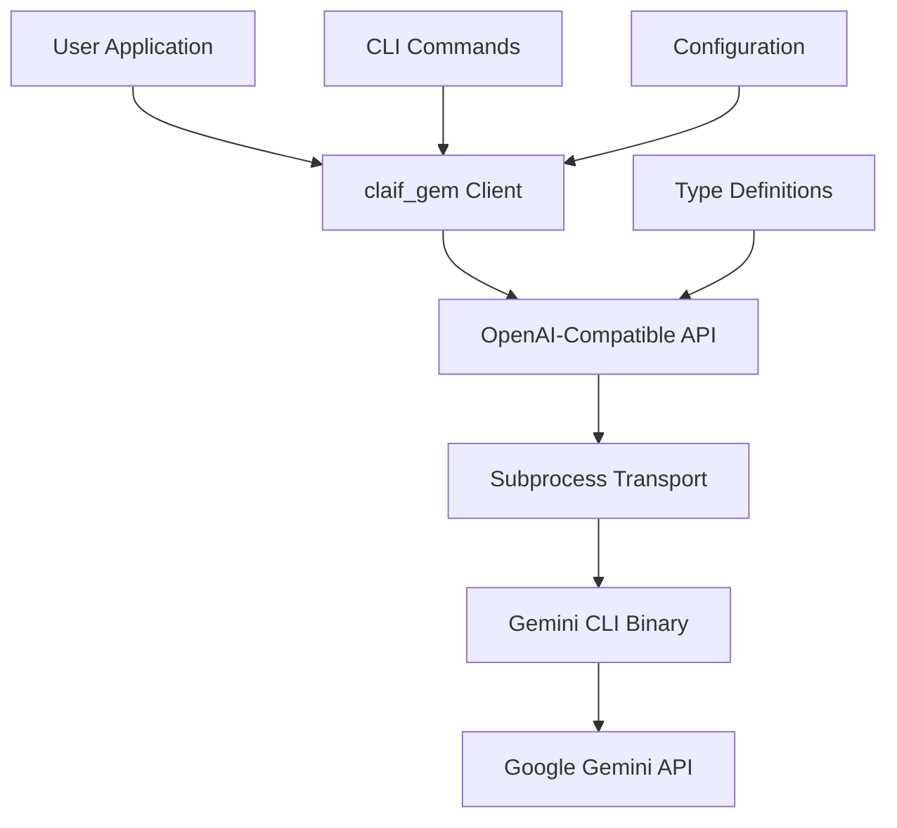

# claif_gem Documentation

<div class="feature-card">
<h2>🚀 Quick Start</h2>
<p>A <strong>Claif provider for Google Gemini</strong> with full OpenAI client API compatibility. This package wraps the <code>gemini-cli</code> command-line tool to provide a consistent interface following the <code>client.chat.completions.create()</code> pattern.</p>
</div>

## 📖 Documentation Overview

This documentation provides comprehensive coverage of the `claif_gem` package, organized into focused chapters for different user needs and experience levels.

### 🎯 TLDR - Essential Information

<div class="api-example">
<div class="api-title">⚡ Quick Installation & Usage</div>
<div class="api-content">

```bash
# Install the package
pip install claif_gem

# Install Gemini CLI (prerequisite)
npm install -g @google/gemini-cli
```

```python
# Use exactly like OpenAI client
from claif_gem import GeminiClient

client = GeminiClient()
response = client.chat.completions.create(
    model="gemini-1.5-flash",
    messages=[{"role": "user", "content": "Hello Gemini!"}]
)
print(response.choices[0].message.content)
```

</div>
</div>

**Key Features:** <span class="badge badge-primary">OpenAI Compatible</span> <span class="badge badge-success">Type Safe</span> <span class="badge badge-info">Streaming</span> <span class="badge badge-warning">Cross-platform</span>

---

## 📚 Documentation Chapters

### 🎯 Getting Started
Learn the basics and get up and running quickly with claif_gem.

| Chapter | Description | Audience |
|---------|------------|----------|
| **[Quick Start](quickstart.md)** | 5-minute setup guide with essential examples | All users |
| **[Installation](installation.md)** | Detailed installation instructions for all platforms | All users |

### 📖 User Guide
Comprehensive guides for everyday usage and configuration.

| Chapter | Description | Audience |
|---------|------------|----------|
| **[Usage Guide](usage.md)** | Complete usage examples and patterns | End users |
| **[Configuration](configuration.md)** | Environment variables, config files, and settings | End users |
| **[CLI Reference](cli-reference.md)** | Complete command-line interface documentation | CLI users |

### 🔧 Developer Guide
In-depth technical documentation for developers and contributors.

| Chapter | Description | Audience |
|---------|------------|----------|
| **[API Reference](api-reference.md)** | Complete Python API documentation | Developers |
| **[Architecture](architecture.md)** | Internal design and implementation details | Developers |
| **[Testing](testing.md)** | Testing guide, examples, and best practices | Contributors |
| **[Contributing](contributing.md)** | Development setup and contribution guidelines | Contributors |

---

## 🧭 Navigation Guide

### 👤 I'm a First-Time User
1. Start with **[Quick Start](quickstart.md)** for immediate setup
2. Follow **[Installation](installation.md)** for detailed setup
3. Explore **[Usage Guide](usage.md)** for comprehensive examples
4. Check **[Configuration](configuration.md)** to customize behavior

### 🔧 I'm a Developer/Integrator
1. Review **[API Reference](api-reference.md)** for complete API docs
2. Understand **[Architecture](architecture.md)** for internal design
3. Examine **[Testing](testing.md)** for testing strategies
4. Study **[Usage Guide](usage.md)** for integration patterns

### 🚀 I Want to Contribute
1. Read **[Contributing](contributing.md)** for development setup
2. Follow **[Testing](testing.md)** for testing guidelines
3. Understand **[Architecture](architecture.md)** for code structure
4. Use **[API Reference](api-reference.md)** for implementation details

### 💻 I'm a CLI User
1. Start with **[Quick Start](quickstart.md)** for basic setup
2. Master **[CLI Reference](cli-reference.md)** for all commands
3. Customize with **[Configuration](configuration.md)** options
4. Explore **[Usage Guide](usage.md)** for advanced CLI patterns

---

## 🏗️ What is claif_gem?

`claif_gem` is the **Google Gemini provider** for the Claif framework with full **OpenAI client API compatibility**. It bridges Google's powerful Gemini language models with the familiar OpenAI client interface through subprocess management and clean message translation.

### 🎯 Core Value Propositions

<div class="feature-card">
<h3>🔄 Drop-in OpenAI Replacement</h3>
<p>Use the exact same <code>client.chat.completions.create()</code> pattern you know from OpenAI, but powered by Google Gemini models.</p>
</div>

<div class="feature-card">
<h3>🛡️ Type-Safe Integration</h3>
<p>Full TypeScript-style type hints and returns standard <code>ChatCompletion</code> objects for seamless integration.</p>
</div>

<div class="feature-card">
<h3>⚡ Streaming Support</h3>
<p>Real-time streaming responses with proper chunk handling for responsive user experiences.</p>
</div>

<div class="feature-card">
<h3>🌍 Cross-Platform CLI</h3>
<p>Automatic CLI discovery and robust subprocess management across Windows, macOS, and Linux.</p>
</div>

### 🏛️ Architecture Overview



### 📊 Supported Models

| Model ID | Name | Context Window | Best For |
|----------|------|----------------|----------|
| `gemini-1.5-pro` | Gemini 1.5 Pro | 2M tokens | Complex reasoning |
| `gemini-1.5-flash` | Gemini 1.5 Flash | 1M tokens | Fast responses |
| `gemini-1.5-flash-8b` | Gemini 1.5 Flash 8B | 1M tokens | Lightweight tasks |
| `gemini-2.0-flash-exp` | Gemini 2.0 Flash (Experimental) | 1M tokens | Latest features |

### 🎮 Usage Patterns

=== "Basic Usage"

    ```python
    from claif_gem import GeminiClient
    
    client = GeminiClient()
    response = client.chat.completions.create(
        model="gemini-1.5-flash",
        messages=[{"role": "user", "content": "Explain quantum computing"}]
    )
    print(response.choices[0].message.content)
    ```

=== "Streaming"

    ```python
    from claif_gem import GeminiClient
    
    client = GeminiClient()
    stream = client.chat.completions.create(
        model="gemini-1.5-pro",
        messages=[{"role": "user", "content": "Write a story"}],
        stream=True
    )
    
    for chunk in stream:
        if chunk.choices[0].delta.content:
            print(chunk.choices[0].delta.content, end="", flush=True)
    ```

=== "CLI Usage"

    ```bash
    # Interactive query
    claif-gem query "Explain machine learning"
    
    # Chat mode
    claif-gem chat --model gemini-1.5-pro
    
    # With configuration
    claif-gem query "Translate to French" --temperature 0.3
    ```

---

## 🚀 Next Steps

<div class="feature-card">
<h3>🎯 New Users</h3>
<p>Start with the <a href="quickstart.md"><strong>Quick Start Guide</strong></a> to get claif_gem running in 5 minutes.</p>
</div>

<div class="feature-card">
<h3>🔧 Developers</h3>
<p>Jump to the <a href="api-reference.md"><strong>API Reference</strong></a> for complete technical documentation.</p>
</div>

<div class="feature-card">
<h3>💻 CLI Users</h3>
<p>Explore the <a href="cli-reference.md"><strong>CLI Reference</strong></a> for all available commands and options.</p>
</div>

<div class="feature-card">
<h3>🤝 Contributors</h3>
<p>Check out the <a href="contributing.md"><strong>Contributing Guide</strong></a> to start contributing to the project.</p>
</div>

---

## 📝 License & Support

**License:** MIT License - see [LICENSE](https://github.com/twardoch/claif_gem/blob/main/LICENSE) for details.

**Support Channels:**
- 🐛 [Issue Tracker](https://github.com/twardoch/claif_gem/issues) - Bug reports and feature requests
- 💬 [Discussions](https://github.com/twardoch/claif_gem/discussions) - Q&A and community support
- 📧 [Email](mailto:adam+github@twardoch.com) - Direct contact with the author

**Related Projects:**
- 🏗️ [Claif Framework](https://github.com/twardoch/claif) - Main framework
- 🤖 [claif_cla](https://github.com/twardoch/claif_cla) - Claude provider
- 💻 [claif_cod](https://github.com/twardoch/claif_cod) - Codex provider